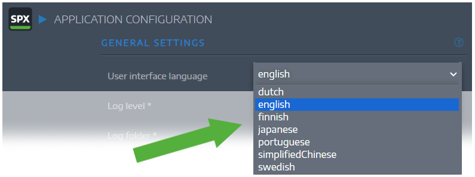
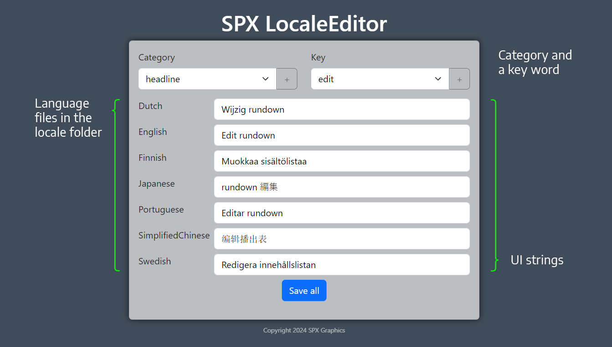

# SPX LocaleEditor app
## Manage language files for SPX Graphics Controller.
> Readme updated May 27 2024. 



The user interface of <a href="https://github.com/TuomoKu/SPX-GC">SPX Graphics Controller</a> can be localized. The utility application in this repo makes it easy to modify `locales/<language>.json` -files.

<br>

# Working principle

SPX server has a `locales` subfolder and there are multiple json -files, one per language. SPX source code uses strings with a `<category>.<key>` syntax, from the currently active locale-file.

The structure of the locale files are identical, but the `value` properties are the translated language strings. See the below example where the _key_ is `red` in the `color` _category_:

```json

// simplifiedChinese.json
 "color": {
    "red": "红色"
 }

// finnish.json
 "color": {
    "red": "punainen"
 }

```
## Install and run

```sh
git clone <github url> .   // get source
node install               // install dependencies
npm run dev                // run in dev mode
```

> **Remember** You need to change the `jsonsPath` variable in `index.js` to point to the folder with your SPX locale files!

<br>

## Usage

The UI is very simple. All found locale files are shown in the UI, then you choose the category and selected key is shown in the text fields.

If you want to create a new language file, simply copy `english.json` to `<mylanguage>.json`, reload the app and start entering values for each of the strings.


